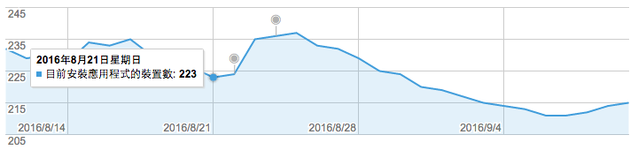
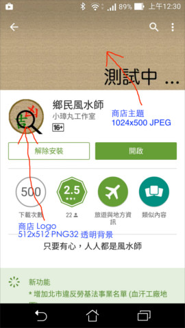

### 鄉民風水師
這是一個利用資料視覺化的方式設計的人文地理工具，目前可查詢：
* 全台灣凶宅地點
* 台北市勞工局違反勞基法事業地點

成果可以在 [Google Play](https://play.google.com/store/apps/details?id=tacoball.com.geomancer) 下載

### 使用趨勢

裝機數/安裝次數：216/1067 (2016-09-17)

### 待填坑事項
需要大大協助改善 App 名稱、Logo、主題圖片
* 有沒有比鄉民風水師更好的名稱？
* 設計 Logo
* 設計商店主題

目前商店截圖如下：

### 閃退紀錄
解決 | 日期 | 版本 | [現象] 原因 | 機種 | Android
---- | ---- | ---- | ---- | ---- | ----
 | 2016-09-19 | 0.0.10 | [OOM] 只有評論、沒有系統回報 | Redmi Note 3 | 5.1
 | 2016-09-05 | 0.0.9 | [OOM] 只有評論、沒有系統回報 | Galaxy S6 | 6.0
 | 2016-08-23 | 0.0.8 | [OOM] 只有評論、沒有系統回報 | Galaxy Note 3 | 5.0
✅ | 2016-08-18 | 0.0.7 | [OOB] 多工時沒鎖定陣列 | Xperia ZL | 5.1
✅ | 2016-07-17 | 0.0.7 | [OOB] 多工時沒鎖定陣列 | Infocus M370 | 6.0
 | 2016-07-11 | 0.0.7 | [OOM] new Bitmap 4194316/906752 | HTC 10 | 6.0
 | 2016-07-10 | 0.0.7 | [NE] Failed to acquire strong reference to pixels | Galaxy S6 | 6.0
✅ | 2016-07-16 | 0.0.7 | [NPE] Exception.getMessage() is null | Xperia Z5 Premium | 6.0
 | 2016-07-05 | 0.0.7 | [OOM] new Bitmap 4194316/1325536 | leo | 5.1
 | 2016-07-04 | 0.0.7 | [OOM] new Bitmap 2097164/1524512 | HTC 10 | 6.0
 | 2016-04-22 | 0.0.7 | [OOM] new Bitmap 4194316/597507 | Galaxy Note 4 | 5.0
✅ | 2016-04-22 | 0.0.7 | [RE] 地圖檔錯誤 | HTC E9pt| 6.0
✅ | 2016-04-17 | 0.0.6 | [OOB] 多工時沒鎖定陣列 | HTC One M9 | 6.0

* NE - 底層錯誤
* NPE - Null 物件參照
* OOB - 陣列索引超出範圍
* OOM - 記憶體用盡
* RE - 執行期間錯誤

### 資料檔位置
離線地圖、凶宅資料庫、違反勞基法資料庫不在 App 中，程式執行時才去鏡相站取得，目前有一個鏡像站：
* http://mirror.ossplanet.net/geomancer/
